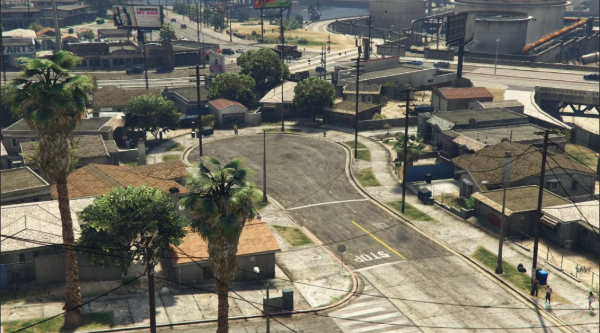

# Los Kindred Blood`s 90 🩸

## Integrantes

* Jefe 👑
  * Nathan Drake
* Subjefe ⚔️

    * Ronald Drake
* Integrantes 🗡️
    * Carlos Konnors
    * Francisco Collins
    * Jonny García
    * Lug Zackary
    * Pancho Pistola Hernández

----

## Historia 📚

Un día normal y corriente un chico llamado Ronald Drake, se 
levantó temprano un día lunes 22 de abril para ir a buscar 
trabajo. Después de un largo día de estar echando currículums, 
al medio día recibió una llamada para trabajar de mecánico en 
un taller. Él, emocionado de haber encontrado 
trabajo, se fue corriendo al taller a informarse de los horarios 
de trabajo.
Al día siguiente, mientras Ronald estaba trabajando, recibió 
una llamada muy importante, en la que le comunicaron que en la 
ciudad donde actualmente vivía su familia, se había producido 
una guerra entre bandas. Su madre, que andaba por la zona, fue 
trágicamente tiroteada.
A lo lejos, se empezaron a escuchar el ruído de las sirenas, la 
policía se estaba aproximando al lugar. Ambas bandas salieron 
corriendo, abandonado allí sin vida el cuerpo de su pobre madre.
Cuando Ronald se enteró de tal impactante noticia, cogió el 
primer vuelo a dicha ciudad. Se juró a si mismo que se cobraría 
venganza.
Nada más aterrizar, Ronald no quiso ni comer ni beber, solo 
tenía una cosa en mente, buscar a dicho maleante y hacerle cosas 
imaginables imposibles de describir en esta vida.
Tras mucho tiempo en su búsqueda sin ningún resultado, se 
encontró con un hombre, con unas pintas un tanto peculiares, 
llamado **Fernando**.
Tras una larga conversación, **Fernando** le confesó que el 
pertenecía a una banda dedicada al secuestro de personas. A 
Ronald en ese momento le cambió el rostro de su cara, parecía 
que iba a matarlo en ese mismo instante. Pero **Fernando** contaba 
con su propia seguridad privada, que amordazó a Ronald 
intentando meterlo en el maletero de su coche, Ronald se 
resistía, tenía más fuerza de lo que pensaban, así que le dio 
con la culata de su pistola dejándolo inconsciente.
Al despertar, Ronald se encontraba en un sótano, lo único que le 
alcanzaba la vista era a él, su secuestrador. Bajo un foco a 
punto de desplomarse, Ronald no comprendía que estaba pasando, a 
lo cual **Fernando** le explicó el por qué estaba allí.

 Me ha llegado a mis oídos que eres nuevo en esta ciudad y 
andas por barrios muy chungos para un forastero, intenta 
convencerme para que no te pegue un tiro ahora mismo- dijo.
Ronald asustado, pero a la misma vez cabreado, comenzó a 
contarle su historia. 
Tras una larga charla, **Fernando** quedó convencido, le ofreció 
ayuda a Ronald, pero bajo una condición, debería trabajar bajo 
su mando. Ronald se encontraba dubitativo, no sabía si aceptar 
su oferta, pero él sabía que no le quedaba otra, si rechazaba su 
oferta correría el peligro de salir con los pies por delante.
Ronald finalmente acepto sus condiciones, pero antes de darle la 
mano dijo:

 ¡Pero deberán ayudarme a encontrar al maldito asesino que 
asesino a mi madre! – dijo Ronald.
Parecía que le estaba a punto de explotar las venas del cuello. 
Al aceptar, firmaron el trato dándose la mano. **Fernando** podía 
notar su frustración en su mano de los fuerte que le estaba 
apretando.
Meses después de haber trabajado con **Fernando**, **Ronald** adoptó el 
alias de “**Dark**”. 
Bryan Cruz, consiguió hacerse un hueco dentro de la banda, hacia 
el papel de atracador y falso rehén como uno más de ellos, 
parecía que llevaba toda su vida haciendo eso, había encontrado 
a su nueva familia, pero nunca podrá olvidar lo sucedido con su 
madre.
**Fernando**, que había aparcado de lado su parte del trato, al 
verlo tan metido dentro de su grupo más cercano, decidió que ya 
era hora de cumplir su parte del pacto que hicieron.
A los tres días, recibió una llamada de uno de sus agentes 
privados comunicándole que había encontrado al responsable del 
asesinato de la madre Ronald. 
**Fernando** y Ronald se encontraban fumando en un despacho 
descansando un rato, cuando **Fernando** le dijo a Ronald:

 Tras esa puerta que tienes delante está lo que te prometí 
tiempo atrás, entra hijo mío. – dijo **Fernando**.
Ronald se dispuso a entrar por la puerta, y allí estaban, en el 
mismo lugar en el que él mismo había estado sentado hacía mucho. 
No dudo, no pestañeó, no tembló, cogió el arma de un compañero 
de su banda que estaba situado a su derecha y disparó. A pesar 
de ese rostro tan característico suyo de cabreado, estaba 
llorando, Ronald estaba llorando, no podía ver otra cosa en su 
cabeza en ese instante que no fuese el rostro de su madre.
**Fernando** fue herido de un tiro de bala en el abdomen, Ronald 
rápidamente salió corriendo con él en brazos a la mansión, allí 
le esperaban un equipo de los mejores médicos de toda la ciudad 
contratados exclusivamente para la banda.
Tras varias semanas con **Fernando** ausente por la operación, por 
fin pudo ponerse en pie para ver a su cuerpo de élite, allí 
estaban, toda su banda, su equipo, **Fernando** tenía más ganas que 
nunca de ir a más. Pero tenía una espina clavada en la espalda, 
el última trabajo que realizaron salieron muchas cosas mal, pero 
la más importante de todas, fue meterse con quien no debían, la 
Yakuza, no quedaba otra opción, debía huir, son demasiado 
poderosos para ellos.
Ronald no le quedó otra, y regresó a su antigua ciudad, 
Los Santos donde tiempo atrás trabajaba honradamente como 
mecánico. No le quedaba otra, volvió al taller con la cabeza 
agachada por la vergüenza de abandonar su empleo sin avisar y no 
regresar hasta ese día. Afortunadamente tenían una vacante y su 
jefe fue bueno con él readmitiéndole en su antiguo puesto 
de trabajo.
Ronald en el taller conoció a Jack, con el que trabajo largo 
tiempo hasta que ambos estaban cansados de no tener dinero casi 
no para vivir.
Ronald no paraba de recordar su vida con **Fernando**, y le propuso 
a Jack pasarse a la vida delictiva como anteriormente hacia. No 
tardaron mucho en planear el primer atraco, estaban muy 
emocionados. 
Jack no se lo podía creer, todo ese dinero encima de la mesa, 
el atraco había salido a la perfección, no tendría que volver a 
poner más bujías, ni reparar más ruedas, acaba de empezar su 
nueva vida.
Tres días más tarde, Ronald estaba descansado en su nuevo sofá, 
cuando recibió una llamada de un número desconocido, no sabía 
quién era, nervioso, respondió al teléfono. Era él, **Fernando**, 
era su voz, nunca se le podría olvidar esa voz, le cambió el 
rostro por completo, se desplomo en el sofá de la tranquilidad 
que le había dado.
Tras varias horas hablando, **Fernando** estaba de camino al 
aeropuerto para reservar un vuelo a Los Santos.
Al aterrizar allí estaba Ronald esperándole desde hacía varias 
horas, tenía muchas ganas de verle, le acompañaba Jack, Ronald 
quería que conociese a su nuevo socio.
Al estar con **Fernando**, Ronald decidió volver a utilizar su 
antiguo apodo, El **Dark**, a lo que Jack saltó y dijo.

A partir de hoy quiero que me llaméis sólo por mi 
primer nombre Jack – Dijo.
Un día, mientras los tres estaban relajándose dando un paseo por 
su barrio, escucharon gritos en una tienda cercana, se acercaron 
a ver que estaba sucediendo. Se estaba produciendo un atraco a 
mano armada, a lo que Ronald, **Fernando** y Jack respondieron 
abriendo fuego contra los atracadores, los rehenes consiguieron 
escapar con ellos, regresando a la casa de El **Dark**.
**Fernando**, tras tranquilizarlo, le ofreció un trato que no 
podría negarse a aceptar, él estaría protegido, no le volvería a 
pasar nada malo, y no dudó en aceptar.
El grupo estaba completo, no había quien los parase en su nueva 
ciudad, y así comenzó la nueva vida de estas 4 personas: **Fernando**, Ronald, Jack y Jesusito García; la nueva banda de 
los Santos, llamada: “Los Kindred Bloods 90'S ”. 

-----

## Coches 🚗

Los coches que usa esta gente suelen ser: Manana, Tornado, 
Bucanero, Peyote, Nemesis todos ellos con detalles rojos. Estos coches 
los usan para moverse, únicamente por la ciudad,despues tienen 
los suyos propios con los que saldrán para actos específicos. La 
vestimenta no era muy cantosa, detalles en rojo pero eso sí, 
todos los miembros llevan la misma bandana roja.

-------------------------------------------------------------

## Sede
Ubicación: 

### Grove Street

----
