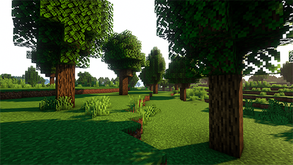
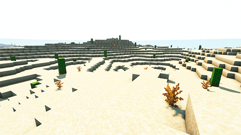
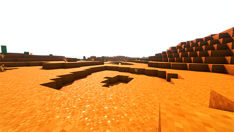
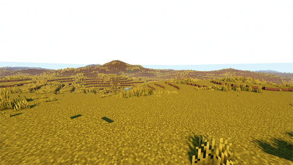
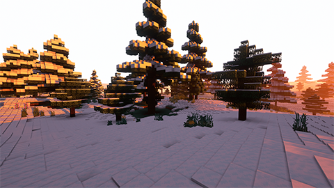

# Biomas 🏕️

El mundo no seria nada sin sus biomas, es lo que lo hace especial y único, gracias a esta guia podras saberlo todo sobre lo que contienen estos biomas.

*Nota: Todas las imagenes usadas estan hechas con los shaders ComplementaryShaders_v4.3.1*

--------

Índice :

----------------

### Bosque 

El bioma más básico solo formado por arboles de roble. En el abitán criaturas pascíficas.

### Desierto
Una zona arida y calurosa, lo unico que sobrevive en ella son los arbustos y los cactus, si te adentras mucho en el podrás encontrar una grandes escruturas que parecen ser hechas por seres de otro planeta.

### Desierto rojo 
Una rara variante del desierto, no se tiene mucha información sobre como a surgido.

### Los prados de Savana
Los lugareños han explotado tanto esta zona que apenas quedan ya arboles en ella, necesita urgentemente una reforestación.

### Bosque helado
Un paraje blanco muy extenso donde se encuentras pocas personas dado por sus bajas temperaturas.

