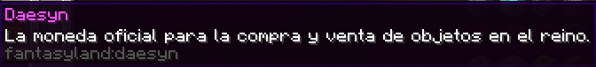
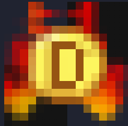
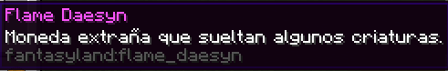
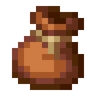
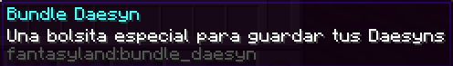

# FantasyLand Mod

Para ayudar a mejorar el ambiente y sistema de comercio se ha creado un mod.

Usando el software **MCreator**, el cual usa el lenguaje de Java, pero no es necesario tener conocimientos de programación, ya que presenta una interfaz gráfica muy intuitiva.

El mod esta compusto por dos monedas:

## Daesyn

El **Daesyn** es la moneda oficial de **FantasyLand 🍄**, con la cual los usuarios podran comerciar con ella. Se conseguira haciendo misiones, retos, mazmorras o vendiendo materiales y objetos raros

## Flame Daesyn 🔥

El **Flame Daesyn** es una moneda extraña, que sirve para comprar objetos especiales, se obtiene al derrotar enemigos especiales o jefes.

## Bundle Daesyn

Esta es una pequeña mochila con **14 slots**, que sirve unicamente para guarda los Daesyns, tiene un capacidad maxima de **896 Daesyns**.

